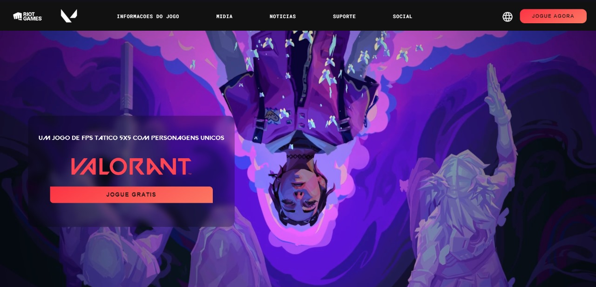

# LD | Valorant |




## Descrição
Este projeto é uma página web dedicada ao jogo Valorant, desenvolvido pela Riot Games. A página inclui informações sobre o jogo, links para agentes, mapas, arsenal, Premier, mídia, notícias, requisitos de sistema e links para redes sociais.

## Funcionalidades
- **Cabeçalho fixo**: Inclui logos e links de navegação.
- **Menus interativos**: Informações do jogo e redes sociais exibem menus adicionais ao clicar.
- **Botão "Jogue Agora"**: Link direto para a página de autenticação do jogo.
- **Área de vídeo**: Vídeo em loop de Clove de Valorant.
- **Seção de créditos**: Links para o perfil do desenvolvedor e redes sociais.
- **Referências**: Link para a página oficial do Valorant e nota de isenção de responsabilidade.

## Tecnologias Utilizadas
- HTML5
- CSS3
- JavaScript

## Estrutura de Arquivos

.
├── src/
│ ├── img/
│ │ ├── logo-RED vava.png
│ │ ├── logo riot.png
│ │ ├── logo vava.png
│ │ ├── globo.png
│ │ ├── instagram.png
│ │ ├── whatsapp.png
│ │ ├── linkedin.png
│ │ ├── mylivewallpapers-com-Clove-Valorant-FHD.mp4
│ │ ├── valorant title.png
│ │ ├── clasificacao14.png
│ ├── css/
│ │ ├── style.css
│ │ ├── header.css
│ │ ├── main.css
│ │ ├── footer.css
│ ├── javascript/
│ │ ├── script.js
├── index.html
└── README.md


## Instruções para Executar o Projeto
1. Clone este repositório:
    ```bash
    git clone https://github.com/JuanRoberto1212/Lading-Page-Valorant.git
    ```
2. Navegue até o diretório do projeto:
    ```bash
    cd nome-do-repositorio
    ```
3. Abra o arquivo `index.html` no seu navegador.

## Créditos
- Desenvolvedor: [Juan Roberto](https://github.com/JuanRoberto1212)
- Redes Sociais:
  - [Instagram]()
  - [WhatsApp]()
  - [LinkedIn]()

## Referências
- [VALORANT HOMEPAGE](https://playvalorant.com/pt-br/)

**Nota**: Esta página é apenas um projeto de estudos, sem gerar nenhuma forma de renda para o desenvolvedor.
